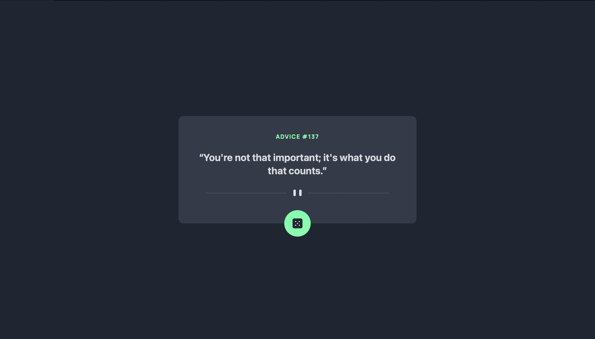

# Frontend Mentor - Advice generator app solution

This is a solution to the [Advice generator app challenge on Frontend Mentor](https://www.frontendmentor.io/challenges/advice-generator-app-QdUG-13db). Frontend Mentor challenges help you improve your coding skills by building realistic projects.

## Table of contents

- [Overview](#overview)
  - [The challenge](#the-challenge)
  - [Screenshot](#screenshot)
  - [Links](#links)
- [My process](#my-process)
  - [Built with](#built-with)
  - [What I learned](#what-i-learned)
  - [Continued development](#continued-development)
  - [Useful resources](#useful-resources)

**Note: Delete this note and update the table of contents based on what sections you keep.**

## Overview

### The challenge

Users should be able to:

- View the optimal layout for the app depending on their device's screen size
- See hover states for all interactive elements on the page
- Generate a new piece of advice by clicking the dice icon

### Screenshot



### Links

- Solution URL: [solution URL here](https://github.com/Leozaur1808/advice-generator-app-main)
- Live Site URL: [live site URL here](https://leozaur1808.github.io/advice-generator-app-main/)

## My process

### Built with

- JS (fetch api)
- Tailwindcss


### What I learned

I have had some practice with fetch before, though this app gave me ability to expand my knowledge by nto only getting the data from api, but also displaying it

However, I think there is a better way of positioning the button like here. Sadly, I don't know it yet.

```html
<div class="absolute mt-2" id="button">
          <button class="inline rounded-full p-5 bg-neonGreen hover:shadow-glow ">
          
          
          </button>
        </div>
```
```js
async function getAdvice() {
    let obj;
    const res = await fetch("https://api.adviceslip.com/advice")
    obj = await res.json()
    return obj;
}
async function setAdvice(){
    result = await getAdvice();
    id.innerText = result.slip.id;
    advice.innerText=`“${result.slip.advice}”`;
}
```

### Continued development

I would like to practice with making unusual component positioning like the button here

**Note: Delete this note and the content within this section and replace with your own plans for continued development.**

### Useful resources

- [StackOverflow](https://stackoverflow.com/questions/45018338/javascript-fetch-api-how-to-save-output-to-variable-as-an-object-not-the-prom) - Fetch api reference


